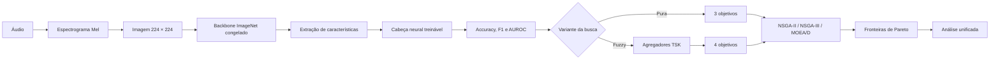

# Otimização multiobjetivo de modelos de classificação de áudio com agregação fuzzy

Base experimental de uma dissertação de mestrado sobre otimização multiobjetivo de pipelines de classificação de áudio. O projeto compara **NSGA-II**, **NSGA-III** e **MOEA/D** na busca conjunta por desempenho preditivo e eficiência computacional, avaliando cada algoritmo com e sem um agregador fuzzy do tipo Takagi–Sugeno–Kang (TSK).

Os estudos principais utilizam os datasets **ESC-50**, para classificação de sons ambientais, e **GTZAN**, para reconhecimento de gêneros musicais. Os experimentos combinam espectrogramas Mel, transferência de aprendizado com backbones pré-treinados e otimização de hiperparâmetros com [`pymoo`](https://pymoo.org/).

> **Estado atual:** o notebook do GTZAN contém uma execução completa e seus resultados históricos. A execução registrada do ESC-50 foi interrompida no início da primeira rodada e ainda não produz resultados comparáveis. Consulte [Estado dos experimentos](#estado-dos-experimentos) e [Limitações metodológicas](#limitações-metodológicas) antes de citar números deste repositório.

## Sumário

- [Questão de pesquisa](#questão-de-pesquisa)
- [Visão geral do método](#visão-geral-do-método)
- [Estrutura do repositório](#estrutura-do-repositório)
- [Configuração experimental](#configuração-experimental)
- [Instalação](#instalação)
- [Datasets e caminhos](#datasets-e-caminhos)
- [Execução](#execução)
- [Resultados disponíveis](#resultados-disponíveis)
- [Artefatos gerados](#artefatos-gerados)
- [Reprodutibilidade](#reprodutibilidade)
- [Limitações metodológicas](#limitações-metodológicas)
- [Protocolo recomendado para a dissertação](#protocolo-recomendado-para-a-dissertação)
- [Referências](#referências)

## Questão de pesquisa

O projeto investiga se a inclusão de um critério de qualidade fuzzy, além dos objetivos preditivos e de custo, altera a capacidade dos algoritmos evolutivos de encontrar soluções competitivas na fronteira de Pareto.

A comparação é feita entre:

- **variante pura**, com três objetivos: erro de classificação, custo normalizado e complemento do AUROC;
- **variante fuzzy**, com os mesmos três objetivos e um quarto objetivo baseado na qualidade agregada pelo sistema TSK.

A principal evidência comparativa é a contribuição de cada algoritmo e variante para uma **fronteira de Pareto unificada no espaço comum de três objetivos**. Essa escolha é mais apropriada do que comparar diretamente hipervolumes de espaços com dimensionalidades diferentes.

## Visão geral do método



O áudio é convertido em espectrograma Mel e representado como uma imagem de três canais. Um backbone pré-treinado na ImageNet atua como extrator fixo de características; apenas a cabeça classificadora é treinada durante a avaliação de cada indivíduo da população evolutiva.

## Estrutura do repositório

```text
pymmoo_applications/
├── README.md
├── esc50/
│   └── esc50_moo_tsk_v23_3alg_nsga2_nsga3_moead.ipynb
├── gtzan/
│   └── gtzan_moo_tsk_v23_3alg_nsga2_nsga3_moead.ipynb
├── Tests/
│   ├── Masters_application_fuzzy.ipynb
│   ├── Testing_Pymoo_lib.ipynb
│   └── nb3_fis_v9.ipynb
├── datasets/                       # local; ignorado pelo Git
└── results/                        # gerado pelos notebooks; ignorado pelo Git
```

| Notebook | Papel | Estado |
|---|---|---|
| `esc50/esc50_moo_tsk_v23_3alg_nsga2_nsga3_moead.ipynb` | Experimento principal no ESC-50 | Implementado; execução registrada incompleta |
| `gtzan/gtzan_moo_tsk_v23_3alg_nsga2_nsga3_moead.ipynb` | Experimento principal no GTZAN | Implementado; execução histórica completa |
| `Tests/Masters_application_fuzzy.ipynb` | Protótipo anterior com espectrogramas GTZAN em PNG | Histórico/experimental |
| `Tests/Testing_Pymoo_lib.ipynb` | Testes iniciais da integração entre PyTorch e `pymoo` | Histórico/experimental |
| `Tests/nb3_fis_v9.ipynb` | Experimento auxiliar com datasets do `torchvision` e FIS | Histórico/experimental |

Os notebooks em `Tests/` ajudam a documentar a evolução da pesquisa, mas não constituem o protocolo principal da dissertação.

## Configuração experimental

### Datasets

| Dataset | Conteúdo | Configuração atual |
|---|---|---|
| ESC-50 | 2.000 clipes de 5 s, 50 classes e 5 folds oficiais | folds 1–3 para treino, 4 para validação/otimização e 5 para teste reservado |
| GTZAN | 1.000 faixas de 30 s, 10 gêneros | divisão pseudoaleatória fixa de 70%/15%/15% para treino, validação e teste |

No ESC-50, o protocolo atual usa uma única separação baseada nos folds, e não a validação cruzada completa de cinco folds. No GTZAN, a divisão usa `random_split` com semente fixa e não aplica estratificação, filtragem por artista ou a versão *fault-filtered*.

### Pré-processamento de áudio

- reamostragem para 22.050 Hz;
- áudio mono;
- duração de 5 s no ESC-50 e até 30 s no GTZAN;
- espectrograma Mel transformado para escala em decibéis;
- normalização por amostra para `[0, 1]`;
- replicação em três canais;
- redimensionamento para `224 × 224`;
- normalização com média e desvio-padrão da ImageNet.

### Backbones e classificador

Os três backbones disponíveis são:

- ResNet18;
- EfficientNet-B0;
- MobileNetV2.

Os pesos pré-treinados na ImageNet são usados para extração de características. A cabeça treinável possui duas camadas ocultas, com 512 e 256 unidades, `BatchNorm`, ReLU e `Dropout`, seguida da camada de saída multiclasse. O treinamento usa entropia cruzada com `label_smoothing=0.1`, `CosineAnnealingLR` e parada antecipada após seis épocas sem melhora da perda de validação.

### Espaço de busca

Cada indivíduo possui 11 genes:

| Hiperparâmetro | Valores/faixa |
|---|---|
| taxa de aprendizado | `1e-4` a `1e-1`, escala logarítmica |
| otimizador | Adam, AdamW ou SGD |
| épocas | 20 a 80 |
| `weight_decay` | `1e-5` a `1e-2`, escala logarítmica |
| backbone | ResNet18, EfficientNet-B0 ou MobileNetV2 |
| `batch_size` | 32, 64 ou 128 |
| `dropout` | 0,1 a 0,5 |
| filtros Mel (`n_mels`) | 32, 64, 128 ou 256 |
| tamanho da FFT (`n_fft`) | 512, 1.024 ou 2.048 |
| razão do `hop_length` | 0,1 a 0,5 de `n_fft` |
| frequência máxima (`fmax`) | 4.000, 8.000 ou 11.025 Hz |

### Objetivos

Todos os objetivos são formulados como minimização:

| Variante | Vetor de objetivos |
|---|---|
| Pura | `[1 - accuracy, custo, 1 - AUROC]` |
| Fuzzy | `[1 - accuracy, custo, 1 - AUROC, 1 - fis_quality]` |

O custo atual é uma aproximação baseada no número de épocas e em uma tabela fixa de latência relativa por backbone. Portanto, ele representa um **proxy computacional**, não uma medição real de tempo, memória, energia ou FLOPs.

### Agregação fuzzy TSK

A variante fuzzy calcula quatro níveis de informação:

1. **FIS-Eval:** combina `accuracy` e F1 macro;
2. **FIS-OOD:** combina AUROC e a variável denominada `fpr_inv`;
3. **FIS-Perf:** combina proxies de latência, complexidade de treinamento, regularização e custo espectral;
4. **FIS-Sel:** agrega os três escores anteriores em `fis_quality`.

As funções de pertinência gaussianas usam cinco estados linguísticos: `very_low`, `low`, `medium`, `high` e `very_high`. Os consequentes TSK e os limiares são definidos manualmente nos notebooks.

### Algoritmos evolutivos

| Algoritmo | Mecanismo principal |
|---|---|
| NSGA-II | ordenação não dominada e distância de aglomeração |
| NSGA-III | pontos/direções de referência para preservar diversidade em vários objetivos |
| MOEA/D | decomposição do problema em subproblemas escalares vizinhos |

Cada algoritmo é executado nas variantes fuzzy e pura, totalizando seis rodadas por dataset. A configuração atual usa população de 30 indivíduos, 15 gerações, crossover SBX (`prob=0.9`, `eta=10`) e mutação polinomial (`eta=15`). A semente global é 42.

## Instalação

### Requisitos

- Python 3.11 recomendado;
- JupyterLab ou Jupyter Notebook;
- GPU CUDA recomendada para as execuções completas, embora CPU seja suportada;
- espaço em disco para datasets, pesos pré-treinados e resultados.

Crie um ambiente virtual a partir da raiz do repositório:

```powershell
python -m venv .venv
.\.venv\Scripts\Activate.ps1
python -m pip install --upgrade pip
pip install jupyterlab torch torchvision pymoo scikit-learn numpy pandas matplotlib scipy librosa soundfile Pillow seaborn tqdm scikit-fuzzy
```

Em Linux ou macOS, a ativação é:

```bash
source .venv/bin/activate
```

O projeto ainda não possui um arquivo de dependências versionado com versões fixas. Para uma reprodução acadêmica exata, registre o ambiente utilizado com `pip freeze` ou adote um arquivo de lock antes da execução definitiva.

## Datasets e caminhos

Os notebooks não contêm mais caminhos absolutos vinculados a um usuário ou computador. Por padrão, procuram os dados em `datasets/`, na raiz do projeto, independentemente do diretório em que o Jupyter foi iniciado.

### Estrutura padrão

```text
datasets/
├── ESC-50-master/
│   ├── audio/
│   │   └── *.wav
│   └── meta/
│       └── esc50.csv
├── gtzan/
│   ├── genres_original/
│   │   ├── blues/*.wav
│   │   ├── classical/*.wav
│   │   └── ...
│   └── images_original/            # somente notebooks históricos em PNG
│       ├── blues/*.png
│       └── ...
└── torchvision/                    # downloads do notebook auxiliar
```

### ESC-50

O ESC-50 pode ser obtido no [repositório oficial](https://github.com/karolpiczak/ESC-50):

```powershell
git clone https://github.com/karolpiczak/ESC-50.git datasets/ESC-50-master
```

O dataset completo é distribuído sob **CC BY-NC**; o subconjunto ESC-10 usa **CC BY**. Consulte a licença e as atribuições no repositório original antes de redistribuir os áudios.

### GTZAN

O GTZAN deve ser obtido separadamente e organizado com uma pasta por gênero dentro de `datasets/gtzan/genres_original/`. O repositório não inclui os áudios. Consulte o artigo original de [Tzanetakis e Cook](https://doi.org/10.1109/TSA.2002.800560) e a descrição do dataset no [TensorFlow Datasets](https://www.tensorflow.org/datasets/catalog/gtzan).

Como a coleção contém material musical e sua redistribuição possui restrições próprias, verifique a origem e os termos da cópia utilizada na pesquisa.

### Usar datasets fora do repositório

As seguintes variáveis de ambiente são aceitas:

| Variável | Finalidade |
|---|---|
| `PYMMOO_DATASETS_DIR` | substitui a raiz padrão `datasets/` |
| `ESC50_ROOT` | aponta diretamente para a pasta que contém `audio/` e `meta/` |
| `GTZAN_AUDIO_DIR` | aponta diretamente para `genres_original/` |
| `GTZAN_IMAGES_DIR` | aponta para os espectrogramas PNG dos notebooks históricos |
| `TORCHVISION_DATA_DIR` | define o diretório de downloads do notebook auxiliar |

Exemplo no PowerShell:

```powershell
$env:PYMMOO_DATASETS_DIR = "D:\datasets"
$env:ESC50_ROOT = "D:\datasets\ESC-50-master"
$env:GTZAN_AUDIO_DIR = "D:\datasets\gtzan\genres_original"
jupyter lab
```

Exemplo em Bash:

```bash
export PYMMOO_DATASETS_DIR=/mnt/data/datasets
export ESC50_ROOT=/mnt/data/datasets/ESC-50-master
export GTZAN_AUDIO_DIR=/mnt/data/datasets/gtzan/genres_original
jupyter lab
```

Variáveis específicas, como `ESC50_ROOT`, têm precedência sobre `PYMMOO_DATASETS_DIR`.

## Execução

1. Instale as dependências.
2. Organize os datasets na estrutura padrão ou defina as variáveis de ambiente.
3. Inicie o Jupyter a partir de qualquer diretório dentro do repositório.
4. Abra primeiro um dos notebooks principais em `esc50/` ou `gtzan/`.
5. Selecione um kernel Python 3.11 com PyTorch instalado.
6. Execute as células em ordem e confirme os caminhos impressos pela célula de configuração.
7. Verifique a contagem de classes e arquivos antes de iniciar o loop evolutivo.

```powershell
jupyter lab
```

As execuções são computacionalmente caras. A execução histórica completa do GTZAN registrada no notebook levou aproximadamente **443 minutos** no ambiente em que foi produzida; esse tempo é apenas indicativo e varia com GPU, CPU, armazenamento e versões das bibliotecas.

## Estado dos experimentos

| Dataset | Execução registrada | Observação |
|---|---|---|
| ESC-50 | Incompleta | interrompida durante a primeira rodada, NSGA-II Fuzzy |
| GTZAN | Completa | seis rodadas concluídas; 2.370 avaliações registradas no cache |

As saídas embutidas nos notebooks são históricas. Alterar caminhos, dependências, hardware ou código e executar novamente pode produzir resultados diferentes.

## Resultados disponíveis

### GTZAN

A execução embutida no notebook GTZAN produziu 47 candidatos únicos provenientes das fronteiras de cada rodada; 12 permaneceram não dominados na fronteira unificada de três objetivos. Desses 12, nove vieram da variante fuzzy e três da variante pura.

| Algoritmo | Variante | HV final | NDS próprio | NDS na unificada | Participação | Accuracy média | F1 médio | AUROC médio | Custo médio | FQ média |
|---|---:|---:|---:|---:|---:|---:|---:|---:|---:|---:|
| NSGA-II | Fuzzy | 0,849607 | 10 | 5 | 41,7% | 77,00% | 77,32% | 0,9660 | 0,3323 | 0,8543 |
| NSGA-III | Fuzzy | 0,912470 | 7 | 4 | 33,3% | 73,05% | 73,40% | 0,9524 | 0,1935 | 0,7871 |
| MOEA/D | Pura | 0,822295 | 5 | 2 | 16,7% | 71,07% | 71,48% | 0,9467 | 0,2667 | 0,7111 |
| NSGA-III | Pura | 0,856458 | 4 | 1 | 8,3% | 77,00% | 77,70% | 0,9631 | 0,2188 | 0,8753 |
| NSGA-II | Pura | 0,871886 | 18 | 0 | 0,0% | 72,56% | 72,84% | 0,9466 | 0,2294 | 0,7746 |
| MOEA/D | Fuzzy | 0,773376 | 3 | 0 | 0,0% | 71,56% | 71,61% | 0,9406 | 0,2125 | 0,7865 |

Nesta execução, **NSGA-II Fuzzy** teve a maior contribuição individual para a fronteira unificada, com cinco soluções, e as variantes fuzzy responderam por 75% das soluções unificadas.

Esses valores devem ser interpretados como resultados exploratórios de **validação**. Embora o notebook defina uma função `eval_on_test`, o fluxo principal registrado não executa uma avaliação final independente da solução selecionada no conjunto de teste. Além disso, os valores de hipervolume das variantes fuzzy e pura pertencem a espaços de quatro e três dimensões, respectivamente, e não são diretamente comparáveis entre si.

### ESC-50

Ainda não há uma execução completa registrada. O notebook validou a estrutura esperada de 2.000 arquivos, 50 classes e 400 exemplos por fold, mas foi interrompido durante as primeiras avaliações da rodada NSGA-II Fuzzy. Não há base para concluir superioridade de algoritmo ou variante no ESC-50 neste estágio.

## Artefatos gerados

Cada notebook principal grava resultados na raiz do projeto:

```text
results/
├── esc50_v23/
│   ├── checkpoints/
│   ├── csv/
│   ├── logs/
│   └── plots/
└── gtzan_v23/
    ├── checkpoints/
    ├── csv/
    ├── logs/
    └── plots/
```

Os artefatos incluem:

- CSVs por algoritmo e variante;
- fronteira de Pareto unificada;
- resumo comparativo;
- histórico e metadados em JSON;
- checkpoint geral em PyTorch;
- gráficos de contribuição, evolução, radar, dispersão e mapa de calor.

Os diretórios `datasets/` e `results/` são ignorados pelo Git para evitar versionar dados grandes, material sujeito a licença e artefatos regeneráveis. Para preservar resultados oficiais da dissertação, use armazenamento de artefatos com versão e registre checksums dos arquivos.

## Reprodutibilidade

Os notebooks configuram:

- semente 42 para Python, NumPy e PyTorch;
- sementes CUDA;
- `torch.backends.cudnn.deterministic = True`;
- `torch.backends.cudnn.benchmark = False`;
- ordenação dos arquivos antes da construção dos datasets;
- cache de avaliações baseado em hash MD5 do vetor evolutivo.

Essas medidas reduzem variação, mas não garantem identidade bit a bit entre versões de CUDA, cuDNN, PyTorch, `pymoo`, drivers ou hardware. O hash também é calculado sobre o vetor contínuo original: vetores distintos que decodificam para os mesmos valores discretos podem ser avaliados mais de uma vez.

Antes de uma execução oficial, registre pelo menos:

```powershell
python --version
pip freeze > environment-freeze.txt
nvidia-smi
git rev-parse HEAD
```

## Limitações metodológicas

1. **GTZAN possui falhas conhecidas.** Há duplicatas, rótulos discutíveis, distorções e repetição de artistas. Uma divisão aleatória pode gerar resultados otimistas. Consulte a [análise de Sturm](https://arxiv.org/abs/1306.1461).
2. **A divisão GTZAN não é estratificada nem filtrada por artista.** O protocolo atual deve ser substituído ou justificado para a versão final da dissertação.
3. **O ESC-50 não usa validação cruzada completa.** A separação 1–3/4/5 preserva os folds oficiais, mas representa apenas uma partição fixa.
4. **Não há teste final registrado nos notebooks principais.** As tabelas atuais refletem métricas usadas durante a busca/validação, não uma estimativa final independente.
5. **A variável `fpr` não é uma taxa de falsos positivos.** Na implementação atual, ela é definida como `1 - accuracy`; consequentemente, `fpr_inv` equivale à própria `accuracy`. Esse nome e o papel dessa entrada devem ser corrigidos ou explicitamente redefinidos antes da análise final.
6. **`obj_fpr` também tem nome impreciso.** Apesar do nome, o valor armazenado é `1 - AUROC`.
7. **O custo é um proxy.** As constantes de latência por backbone não são medições no hardware da execução.
8. **Hipervolumes têm dimensões diferentes.** HV de três objetivos e HV de quatro objetivos não devem ser usados em comparação direta.
9. **Os limiares TSK são manuais.** O notebook ESC-50 reutiliza perfis definidos para o experimento-base; é necessária calibração independente ou análise de sensibilidade.
10. **A evidência usa uma única semente.** Não há repetições suficientes para intervalos de confiança ou testes estatísticos entre algoritmos.
11. **Erros de leitura no GTZAN podem ser mascarados.** O carregador WAV atual substitui silenciosamente por uma imagem vazia qualquer áudio que gere exceção; em uma execução final, o erro deve ser registrado e tratado explicitamente.
12. **O checkpoint geral não preserva todos os modelos.** Ele registra chaves do cache e resumos, mas não todos os pesos necessários para reconstruir cada solução.

## Protocolo recomendado para a dissertação

Para transformar os notebooks atuais em evidência experimental defensável:

1. fixe versões de Python e dependências;
2. registre checksums e proveniência de cada dataset;
3. use no GTZAN uma divisão *fault-filtered* e com separação por artista;
4. execute validação cruzada nos cinco folds do ESC-50 ou justifique formalmente a partição fixa;
5. mantenha o teste completamente isolado da otimização e da seleção fuzzy;
6. repita cada algoritmo com várias sementes e reporte média, desvio-padrão e intervalos de confiança;
7. mantenha o mesmo orçamento de avaliações entre algoritmos, considerando que NSGA-III e MOEA/D podem ajustar a população ao número de direções de referência;
8. compare variantes no espaço comum de objetivos e use indicadores compatíveis, como contribuição à fronteira unificada, cobertura e hipervolume recalculado no mesmo espaço;
9. faça ablação do agregador fuzzy e análise de sensibilidade de funções de pertinência, consequentes e pesos;
10. meça latência, memória, energia ou FLOPs no hardware alvo em vez de depender apenas dos proxies;
11. salve pesos, parâmetros decodificados, partições, previsões e métricas por classe de cada solução selecionada;
12. documente critérios de seleção da solução final antes de consultar o conjunto de teste.

## Referências

- K. J. Piczak. “ESC: Dataset for Environmental Sound Classification.” *Proceedings of ACM Multimedia*, 2015. [DOI: 10.1145/2733373.2806390](https://doi.org/10.1145/2733373.2806390).
- G. Tzanetakis e P. Cook. “Musical Genre Classification of Audio Signals.” *IEEE Transactions on Speech and Audio Processing*, 10(5), 293–302, 2002. [DOI: 10.1109/TSA.2002.800560](https://doi.org/10.1109/TSA.2002.800560).
- B. L. Sturm. “The GTZAN Dataset: Its Contents, Its Faults, Their Effects on Evaluation, and Its Future Use.” 2013. [arXiv:1306.1461](https://arxiv.org/abs/1306.1461).
- J. Blank e K. Deb. “pymoo: Multi-Objective Optimization in Python.” *IEEE Access*, 8, 89497–89509, 2020. [DOI: 10.1109/ACCESS.2020.2990567](https://doi.org/10.1109/ACCESS.2020.2990567).
- K. Deb et al. “A Fast and Elitist Multiobjective Genetic Algorithm: NSGA-II.” *IEEE Transactions on Evolutionary Computation*, 2002. [DOI: 10.1109/4235.996017](https://doi.org/10.1109/4235.996017).
- K. Deb e H. Jain. “An Evolutionary Many-Objective Optimization Algorithm Using Reference-Point-Based Nondominated Sorting Approach, Part I: Solving Problems With Box Constraints.” *IEEE Transactions on Evolutionary Computation*, 2014. [DOI: 10.1109/TEVC.2013.2281535](https://doi.org/10.1109/TEVC.2013.2281535).
- Q. Zhang e H. Li. “MOEA/D: A Multiobjective Evolutionary Algorithm Based on Decomposition.” *IEEE Transactions on Evolutionary Computation*, 2007. [DOI: 10.1109/TEVC.2007.892759](https://doi.org/10.1109/TEVC.2007.892759).

## Licença e uso dos dados

Este repositório ainda não declara uma licença de software. Até que um arquivo `LICENSE` seja adicionado, não se deve presumir permissão de reutilização ou redistribuição do código.

Os datasets não fazem parte do repositório e permanecem sujeitos às licenças e condições de seus respectivos mantenedores. Em especial, o ESC-50 completo usa CC BY-NC e exige atribuição; o conteúdo musical do GTZAN requer verificação separada de origem e direitos de uso.
